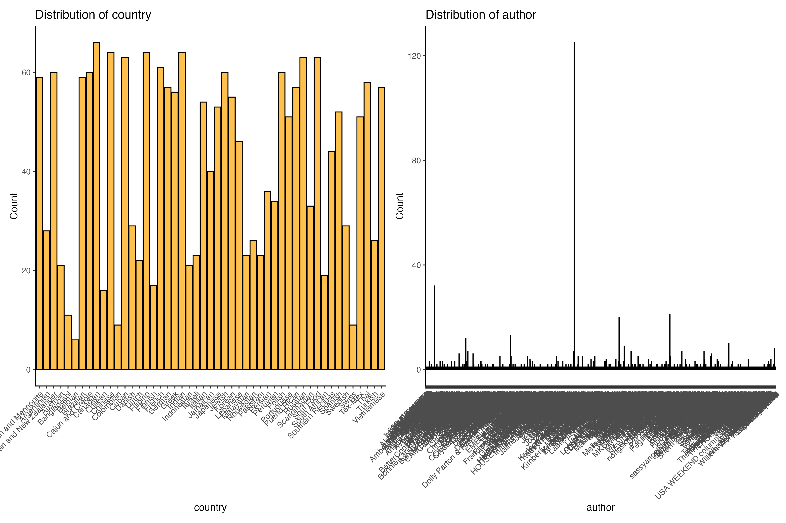
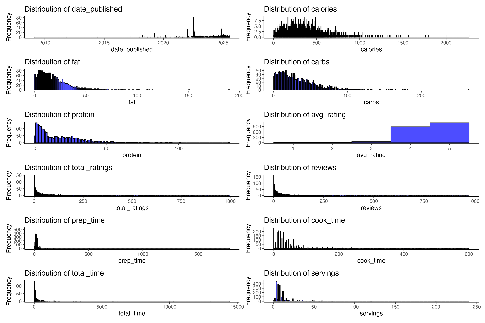

```{r setup, include=FALSE}
knitr::opts_chunk$set(echo = FALSE, message = FALSE, warning = FALSE, fig.width = 8)
library(knitr)
```

# Introduction

This short report summarizes basic exploratory data analysis and author-level summaries for the TidyTuesday "cuisines" dataset. Figures included below are produced by the project's pipeline (`clean_data.r`, `author_analysis.r`) and listed as targets in the Makefile.

# Data

The cleaned dataset is written to `data/clean_cuisines.csv` by `clean_data.r`. The original source is the TidyTuesday dataset used in the project (tidytuesdayR::tt_load(2025, week = 37)).

# Variable distributions

## Categorical distributions

```{r fig_cat, fig.cap="Categorical variable distributions (all categorical columns)"}

```

## Numeric distributions

```{r fig_num, fig.cap="Numeric variable distributions (histograms / densities)"}

```

## Country distribution

```{r fig_country, fig.cap="Distribution of recipes by country"}
knitr::include_graphics("figures/country_distribution.png")
```

# Author-level analysis

## Author success overview

```{r fig_author_success, fig.cap="Author success: productivity and rating summaries"}
knitr::include_graphics("figures/author_success.png")
```

## Top authors by cuisine mix

```{r fig_top_auth_cuisine, fig.cap="Top authors and their cuisine specializations"}
knitr::include_graphics("figures/top_authors_cuisines.png")
```

## Top authors: total time and calories

```{r fig_top_time, fig.cap="Top authors by total recipe time"}
knitr::include_graphics("figures/top_authors_total_time.png")
```

```{r fig_top_cal, fig.cap="Top authors by calories"}
knitr::include_graphics("figures/top_authors_calories.png")
```

